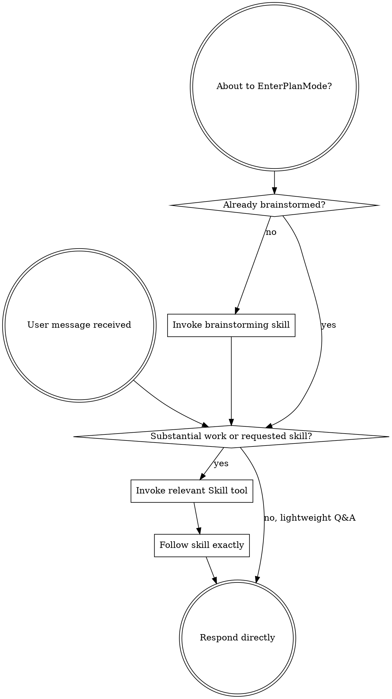

<SUBAGENT-STOP>
If you were dispatched as a subagent to execute a specific task, skip this skill.
</SUBAGENT-STOP>

<IMPORTANT>
Use skills when they materially improve correctness, safety, consistency, or quality. Do not invoke skills for simple explanations, short Q&A, conversational follow-ups, or already-resolved context unless a new substantial task begins.

If the user explicitly requests a skill, or the task involves code changes, debugging, tests, reviews, commits, UI/design work, visual artifacts, reports, multi-step research, or risky operations, invoke the relevant skill before acting.
</IMPORTANT>

## Instruction Priority

Superpowers skills override default system prompt behavior, but **user instructions always take precedence**:

1. **User's explicit instructions** (CLAUDE.md, GEMINI.md, AGENTS.md, direct requests) — highest priority
2. **Superpowers skills** — override default system behavior where they conflict
3. **Default system prompt** — lowest priority

If CLAUDE.md, GEMINI.md, or AGENTS.md says "don't use TDD" and a skill says "always use TDD," follow the user's instructions. The user is in control.

## How to Access Skills

Use the platform skill tool (`Skill`, `skill`, or `activate_skill`) when a skill is actually needed. When invoked, follow the loaded skill directly.

## Platform Adaptation

Skills may use Claude Code tool names. In other environments, map them to equivalent local tools.

# Using Skills

## The Rule

**Invoke relevant or requested skills before substantial work.** Skill calls should be useful, not automatic. Skip skill loading for lightweight explanation, status, translation, wording, or casual follow-up questions when no workflow guidance is needed.

## When to Use Skills

Use skills for:

- Code changes, feature work, behavior changes, refactors
- Debugging, test failures, flaky behavior, regressions
- Test writing, reviews, commits, branches, PR readiness
- UI/design work, visual artifacts, reports, dashboards, slides
- Multi-step research, blocked web access, source-heavy analysis
- Risky or irreversible operations
- Any explicit user request to use or inspect a skill

Usually skip skills for:

- Simple explanations of already-loaded context
- Short conversational follow-ups
- Translation, wording, naming, or small text-only answers
- Status summaries with no new action
- Clarifications that do not require a workflow

## Red Flags

| Thought | Reality |
|---------|---------|
| "This changes code or user-visible behavior" | Check relevant skills first. |
| "This is debugging/test/review/commit work" | Use the matching process skill. |
| "This creates UI, report, visual artifact, or research output" | Use the matching design/artifact/research skill. |
| "This is risky or multi-step" | Skills help avoid unsafe shortcuts. |
| "This is just a simple explanation" | Usually skip skills and answer directly. |
| "This is a short follow-up with no new task" | Usually skip skills and preserve context. |

## Skill Priority

When multiple skills could apply, use this order:

1. **Process skills first** (brainstorming, debugging) - these determine HOW to approach the task
2. **Implementation skills second** (frontend-design, mcp-builder) - these guide execution

"Let's build X" → brainstorming first, then implementation skills.
"Fix this bug" → debugging first, then domain-specific skills.

## Skill Types

**Rigid** (TDD, debugging): Follow exactly. Don't adapt away discipline.

**Flexible** (patterns): Adapt principles to context.

The skill itself tells you which.

## User Instructions

Instructions say WHAT, not HOW. "Add X" or "Fix Y" usually implies a workflow skill; "what is X?" or a small conversational follow-up usually does not.
