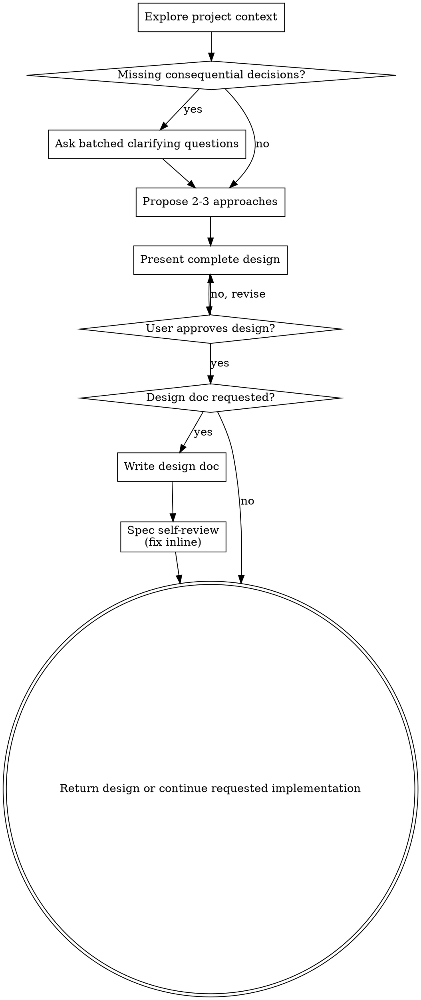

# Brainstorming Ideas Into Designs

Help turn early or ambiguous ideas into fully formed designs and specs through focused collaborative dialogue.

Use this workflow only when the user wants ideation/design work or when a consequential product decision is truly missing. A request such as "make this HTML game" or "build this component" with concrete behavior and constraints is an implementation request, not a brainstorming request.

<HARD-GATE>
Apply the design approval gate only when the user explicitly requested brainstorming, a design/spec, or planning-only work. Do not apply it to direct implementation requests. If this skill was selected for a request that is already specific enough to build, stop the brainstorming workflow and immediately continue the original implementation task.
</HARD-GATE>

## Direct-Build Fast Path

When the user asks to create, build, implement, fix, or modify something and has supplied enough constraints:

- Do not offer a visual companion or ask the user to choose a style unless that choice is essential.
- Do not present several approaches merely because alternatives exist.
- Do not ask "should I proceed?" or request approval after restating the request.
- Do not create a design document instead of the requested artifact.
- Choose reasonable defaults, implement in the same run, and verify the result.
- After the user answers a necessary clarification or chooses an option, resume the original implementation immediately without another approval round.

## Checklist

For an actual brainstorming or design-only request, use the smallest useful subset of these steps:

1. **Explore project context** — check files, docs, recent commits
2. **Ask necessary clarifying questions** — batch related decisions and avoid serial approval loops
3. **Propose 2-3 approaches** — with trade-offs and your recommendation
4. **Present design** — scaled to complexity, with one approval point for the complete design
5. **Write design doc when requested** — use `docs/brainstorming/specs/YYYY-MM-DD-<topic>-design.md` by default
6. **Spec self-review** — quick inline check for placeholders, contradictions, ambiguity, scope (see below)
7. **Transition as requested** — stop after the design for planning-only requests, or implement when the user asked for both design and implementation

## Process Flow

**For brainstorming-only work, the terminal state is a reviewed design.** For a direct implementation request, this workflow does not apply.

## The Process

**Understanding the idea:**

- Check out the current project state first (files, docs, recent commits)
- Before asking detailed questions, assess scope: if the request describes multiple independent subsystems (e.g., "build a platform with chat, file storage, billing, and analytics"), flag this immediately. Don't spend questions refining details of a project that needs to be decomposed first.
- If the project is too large for a single spec, help the user decompose into sub-projects: what are the independent pieces, how do they relate, what order should they be built? Then brainstorm the first sub-project through the normal design flow. Each sub-project gets its own spec → plan → implementation cycle.
- For appropriately-scoped projects, batch related questions and stay within the active system clarification budget
- Prefer multiple choice questions when possible, but open-ended is fine too
- Only one question per message - if a topic needs more exploration, break it into multiple questions
- Focus on understanding: purpose, constraints, success criteria

**Exploring approaches:**

- Propose 2-3 different approaches with trade-offs
- Present options conversationally with your recommendation and reasoning
- Lead with your recommended option and explain why

**Presenting the design:**

- Once you believe you understand what you're building, present the design
- Scale each section to its complexity: a few sentences if straightforward, up to 200-300 words if nuanced
- Ask for approval once after the complete design, not after every section
- Cover: architecture, components, data flow, error handling, testing
- Be ready to go back and clarify if something doesn't make sense

**Design for isolation and clarity:**

- Break the system into smaller units that each have one clear purpose, communicate through well-defined interfaces, and can be understood and tested independently
- For each unit, you should be able to answer: what does it do, how do you use it, and what does it depend on?
- Can someone understand what a unit does without reading its internals? Can you change the internals without breaking consumers? If not, the boundaries need work.
- Smaller, well-bounded units are also easier for you to work with - you reason better about code you can hold in context at once, and your edits are more reliable when files are focused. When a file grows large, that's often a signal that it's doing too much.

**Working in existing codebases:**

- Explore the current structure before proposing changes. Follow existing patterns.
- Where existing code has problems that affect the work (e.g., a file that's grown too large, unclear boundaries, tangled responsibilities), include targeted improvements as part of the design - the way a good developer improves code they're working in.
- Don't propose unrelated refactoring. Stay focused on what serves the current goal.

## After the Design

**Documentation:**

- Write the validated design (spec) to `docs/brainstorming/specs/YYYY-MM-DD-<topic>-design.md`
  - (User preferences for spec location override this default)
- Use elements-of-style:writing-clearly-and-concisely skill if available

**Spec Self-Review:**
After writing the spec document, look at it with fresh eyes:

1. **Placeholder scan:** Any "TBD", "TODO", incomplete sections, or vague requirements? Fix them.
2. **Internal consistency:** Do any sections contradict each other? Does the architecture match the feature descriptions?
3. **Scope check:** Is this focused enough for a single implementation plan, or does it need decomposition?
4. **Ambiguity check:** Could any requirement be interpreted two different ways? If so, pick one and make it explicit.

Fix any issues inline. No need to re-review — just fix and move on.

**User Review Gate:**
When the user explicitly requested a reviewable spec before implementation, ask them to review it:

> "Spec written to `<path>`. Please review it and let me know if you want to make any changes before we start writing out the implementation plan."

Wait only when the user requested planning/design-only work or explicitly asked for a review gate. Otherwise continue the implementation requested in the original task.

**Implementation:**

- Create a detailed implementation plan using the current project’s normal planning workflow.
- If a dedicated planning skill is available and relevant, use it; otherwise write the plan directly.

## Key Principles

- **Batch necessary questions** - Avoid serial clarification and approval loops
- **Multiple choice preferred** - Easier to answer than open-ended when possible
- **YAGNI ruthlessly** - Remove unnecessary features from all designs
- **Explore alternatives** - Always propose 2-3 approaches before settling
- **Incremental validation** - Present design, get approval before moving on
- **Be flexible** - Go back and clarify when something doesn't make sense

## Visual Companion

A browser-based companion for showing mockups, diagrams, and visual options during brainstorming. Available as a tool — not a mode. Accepting the companion means it's available for questions that benefit from visual treatment; it does NOT mean every question goes through the browser.

**Offering the companion:** Offer it only during an explicit brainstorming/design workflow when seeing alternatives is materially useful. Never offer it as a detour from a concrete build request:
> "Some of what we're working on might be easier to explain if I can show it to you in a web browser. I can put together mockups, diagrams, comparisons, and other visuals as we go. This feature is still new and can be token-intensive. Want to try it? (Requires opening a local URL)"

Keep the offer brief and combine it with the first necessary design question so it does not create a separate approval turn. If they decline, proceed with text-only brainstorming.

**Per-question decision:** Even after the user accepts, decide FOR EACH QUESTION whether to use the browser or the terminal. The test: **would the user understand this better by seeing it than reading it?**

- **Use the browser** for content that IS visual — mockups, wireframes, layout comparisons, architecture diagrams, side-by-side visual designs
- **Use the terminal** for content that is text — requirements questions, conceptual choices, tradeoff lists, A/B/C/D text options, scope decisions

A question about a UI topic is not automatically a visual question. "What does personality mean in this context?" is a conceptual question — use the terminal. "Which wizard layout works better?" is a visual question — use the browser.

If they agree to the companion, read the detailed guide before proceeding:
`skills/brainstorming/visual-companion.md`
