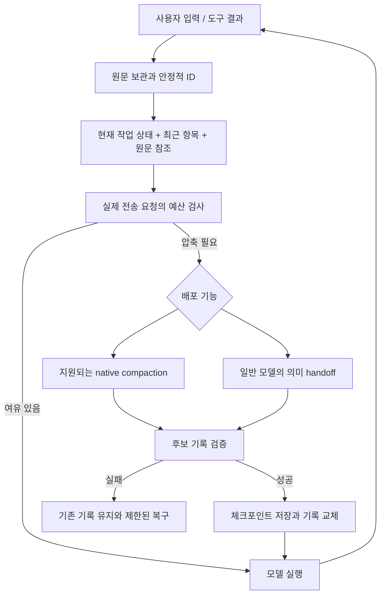

# Codex CLI 심층 검토: MyHarness의 컨텍스트 유지·압축 개선

작성일: 2026-09-16 · 최초 검토 범위: 소스 분석, 오프라인 재현, 관련 기존 테스트

> 이후 사용자 승인으로 구현을 진행했습니다. 아래의 결함 재현·“프로그램 수정 없음” 표기는 **수정 전 조사 기록**입니다. 현재 반영 내용과 검증 결과는 [구현 결과](CODEX_CONTEXT_COMPACTION_IMPLEMENTATION_20260916.md)를 참고하세요.

## 1. 결론과 권고

`openai/codex`는 OpenAI가 공개한 Codex CLI 저장소가 맞습니다. **MyHarness의 GPT 실행 경로를 개선하기 위한 우선 참고 구현으로 적합합니다.** 특히 배울 점은 요약 프롬프트 자체보다 **모델에 전달하는 기록의 정확성, 압축 전후 상태 전환, 실제 사용량 기반 예산, 재시작 후 동일한 문맥 복원**입니다. [Codex README][C01], [공식 Codex Prompting Guide][D01]

다만 “OpenAI 공식이므로 모든 환경에서 가장 안정적”이라는 결론은 근거가 부족합니다. 공개 클라이언트와 서버의 압축 기능은 다르고, 최신 `main`의 코드가 배포 버전·사내 게이트웨이에서도 지원된다는 보장은 없습니다. Codex의 로컬 요약 경로 자체도 반복 압축에 따른 정확도 저하를 경고합니다. **참고할 구현의 신뢰도는 높지만, MyHarness의 업무 성공률은 별도 검증해야 합니다.** [로컬 압축 구현][C02]

권고 방향은 **MyHarness를 유지하면서 Codex의 상태 보존 계약을 이식**하는 것입니다. 지금 전체 엔진을 Codex SDK나 Rust로 바꿀 이유는 확인되지 않았습니다. 오히려 현재 MyHarness에 이미 있는 원문 보관·세션 문서·작업 초점 보존을 살리고, 아래 빈틈을 먼저 메우는 것이 효과적입니다.

### 사용자 확정 방향: Codex·P-GPT 모두 Responses API

검토 중 추가된 사용자 요구는 **Codex와 P-GPT의 모든 모델 실행 경로를 Responses API로 통일**하는 것입니다. 이 문서에서 API 전환은 선택지가 아니라 목표 구조의 전제입니다. `OpenAI-compatible`은 일반적인 호환성을 뜻하기도 하지만, 여기서는 현재 `OpenAICompatibleClient`의 **Chat Completions 실행 경로를 제거하는 방향**으로 구체화합니다.

- Codex: 현재 Responses transport를 유지하면서 item 순서·phase·상태 보존을 보완합니다.
- P-GPT: GPT-5.6에만 조건부 위임하는 구조를 없애고 Responses client를 직접 사용하도록 전환합니다.
- 인증·base URL·사내 인증서·직원/회사 식별 처리 등 배포별 설정은 각 모드에 유지합니다.
- `/chat/completions` 자동 fallback은 목표 구조에서 허용하지 않습니다. Responses 미지원은 명시적인 배포 호환성 오류로 처리합니다.
- Responses 사용 여부와 **native compaction 지원 여부**는 별개입니다. native compaction을 지원하지 않는 배포의 의미 요약도 Responses API를 통해 수행합니다.
- 일반 대화뿐 아니라 도구 반복, 압축 요약, 프롬프트 보강, 백그라운드 작업, 사전 캐시 준비 등 같은 client를 사용하는 보조 호출까지 전환 범위를 확인해야 합니다.

현재 코드에서는 `ui/runtime.py::_resolve_api_client_from_settings`가 P-GPT에 `OpenAICompatibleClient(enable_gpt56_responses=True)`를 생성하고, 해당 client는 Responses endpoint 오류에서 Chat Completions로 전환할 수 있습니다. 따라서 설정 이름만 바꾸거나 GPT-5.6 분기만 넓히는 것으로 완료 처리하면 안 됩니다. **이 문서의 분석 시점에는 아직 실제 전환을 구현하지 않았습니다.** [런타임 구성][M14], [현재 fallback][M12]

회사에서 제공한 동작 예제를 사용자가 추가로 전달했습니다. 아래 **「회사 제공 P-GPT Responses 예제」**를 P-GPT 수정 시 우선 참고 근거로 사용합니다. 기본 Responses 호출은 사용자 확인상 동작하며, native compaction 등 예제에 없는 선택 기능은 별도로 검증합니다.

| 우선순위 | 제안 | 이유 |
|---|---|---|
| P0 | Codex·P-GPT를 Responses API로 통일 | 사용자 확정 방향입니다. 모델별 Chat Completions 분기와 자동 fallback을 제거해야 합니다. |
| P0 | 원문을 먼저 보관한 뒤 압축·삭제 | 현재 자동 압축에서 사용자 입력의 중간 내용이 아카이브에도 남지 않는 경로를 재현했습니다. |
| P0 | Responses 응답 항목의 순서·경계·`phase` 보존 | 현재 변환은 텍스트를 합치고 상태 블록을 앞으로 이동시킬 수 있습니다. |
| P1 | 실제 요청 전체를 기준으로 예산 산정 | 현재 로컬 추정은 이미지·불투명 상태·시스템 프롬프트·도구 스키마를 모두 포괄하지 못합니다. |
| P1 | 간이 발췌를 정상 의미 요약과 구분 | 앞 160자씩 모으는 경로가 LLM 요약보다 먼저 선택됩니다. |
| P1 | 압축 결과의 완료·축소·계속 수행 가능성 검증 | 잘린 요약을 성공으로 설치하는 경우를 재현했습니다. |
| P1 | 기능 지원 여부에 따른 provider 전략 선택 | 모델 이름만으로 압축 기능을 판단하기에는 endpoint 차이가 큽니다. |
| P2 | 압축 체크포인트와 재시작·모델 변경 테스트 강화 | 같은 세션을 복원해도 다음 요청이 같아야 합니다. |
| P2 | 장기 메모리를 별도 단계로 개선 | 현재 작업의 문맥 보존을 먼저 해결하고, 추가 LLM 비용을 통제해야 합니다. |

P0/P1/P2는 이 검토의 도입 순서입니다. 모든 항목을 실제 운영 장애로 관측했다는 뜻은 아닙니다. 재현 결과와 설계상 위험을 아래에서 구분합니다.

## 2. 분석 기준과 검증 범위

### 고정한 소스

- Codex: `https://github.com/openai/codex`
- 분석 커밋: `2aff7208fe95f331d9bb966bbd265c36ee5ecebf`
- 커밋 시각: `2026-09-16T09:03:41Z`
- 커밋 제목: `Add a hidden HTTP/3 TCP tunnel command (#45900)`
- 가져온 방식: `git clone --depth 1`, 분석 당시 기본 브랜치 HEAD. **특정 안정 릴리즈 태그를 검증한 것은 아닙니다.**
- MyHarness 기준 HEAD: `5e2e0d8a9c2a8d9a18f8bde543cfddfbe96faca4`와 현재 작업트리.
- 기존 설정·프론트엔드 변경이 있었으며, 해당 변경은 수정하거나 되돌리지 않았습니다.
- 검토 중 다른 작업으로 보이는 엔진·UI 변경도 관측되어, 종료 직전에 재현 스크립트와 관련 테스트를 다시 실행했습니다. 아래 결과는 재확인한 결과입니다.

이 문서의 GitHub 링크는 모두 위 Codex 커밋을 가리킵니다. MyHarness 링크는 현재 로컬 소스와 줄 번호입니다. 이후 수정되면 줄 번호가 달라질 수 있으므로 함수 이름도 함께 기록했습니다.

### 수행한 확인

1. 공식 OpenAI 문서에서 Compaction API와 Responses 항목 유지 계약 확인.
2. MyHarness의 기존 CodeGraph 인덱스 조회 후 관련 파일·호출 경로 직접 확인.
3. Codex의 로컬 압축, 원격 V2 압축, 예산 판정, 기록 정규화, 체크포인트 복원, 메모리 파이프라인 확인.
4. MyHarness 기존 관련 테스트 **131개 통과**.
5. 외부 모델 호출 없는 합성 데이터로 **7개 관측 항목** 재현.

Codex Rust 테스트 전체 빌드·실행, 실제 OpenAI/사내 API 호출, 장시간 품질 A/B 평가, 장애 주입을 통한 디스크 복구 검증은 수행하지 않았습니다. 따라서 “Codex보다 MyHarness가 몇 % 덜 안정적” 같은 수치 판단은 하지 않습니다.

## 3. Codex 프로젝트에서 읽어야 할 구조

| 영역 | 분석 대상 | MyHarness에 주는 의미 |
|---|---|---|
| 실행 루프 | `codex-rs/core/src/session/turn.rs` | 턴 시작·도구 후속 실행·모델 변경의 압축 시점을 조정합니다. |
| 모델에 보낼 기록 | `core/src/context_manager/history.rs`, `normalize.rs` | UI에 보이는 대화와 실제 모델 입력은 다른 표현이어야 합니다. |
| 압축 전략 | `compact.rs`, `compact_remote_v2*.rs`, `compact_token_budget.rs` | 압축을 단일 요약 함수로 취급하지 않습니다. |
| provider·모델 정보 | `model-provider/src/provider.rs`, `protocol/src/openai_models.rs` | 모델 창 크기, 유효 예산, provider 기능을 분리합니다. |
| 영속화·복원 | `core/src/session/mod.rs`, `rollout_reconstruction.rs`, `rollout/` | 요약문뿐 아니라 교체된 기록과 실행 문맥을 복원합니다. |
| 장기 메모리 | `memories/read`, `memories/write` | 세션 압축과 세션 간 지식 축적은 별도 시스템입니다. |
| 임베딩 방식 | `sdk/typescript` | TypeScript SDK는 CLI 프로세스를 실행하고 JSONL 이벤트를 교환하는 래퍼입니다. |

SDK 채택은 “압축 함수 하나를 가져오기”가 아닙니다. 실행 프로세스·상태 소유권·도구·인증 경로까지 통합하는 선택입니다. MyHarness가 이미 제공하는 사무 업무 도구와 여러 provider를 유지하려면, 우선 Python 엔진의 계약을 보완하는 쪽이 변경 범위가 작습니다. [SDK 설명][C03]

## 4. 서로 다른 네 종류의 ‘기억’을 구분해야 합니다

| 종류 | 목적 | 유지되어야 하는 내용 |
|---|---|---|
| 원본 기록 | 감사·재조회·복구 | 실제 입력, 도구 출력, 이벤트, 출처 |
| 현재 모델 입력 | 이번 추론 수행 | 현재 지침, 최근 대화, 도구 호출/결과, 상태 항목 |
| 압축된 작업 상태 | 같은 일을 다음 문맥에서 계속 | 목표, 제약, 결정, 검증 결과, 미완료 작업, 원문 포인터 |
| 장기 메모리 | 다른 세션에서 재사용 | 지속적인 선호, 프로젝트 규칙, 검증된 재사용 지식 |

Prompt cache는 별도입니다. 같은 입력 접두부를 효율적으로 처리하는 기능이지, 빠뜨린 업무 맥락을 대신 기억해 주는 저장소가 아닙니다. 캐시 효율을 위해 지침·도구 정렬을 안정화하더라도 원본 보관과 압축 품질을 대체할 수는 없습니다.

MyHarness의 `session_memory`라는 이름은 주의해서 읽어야 합니다. 여기서는 장기 메모리 서비스가 아니라 **현재 대화를 짧은 문자열로 발췌하는 결정적 압축 경로**입니다. [MyHarness 간이 압축][M01]

## 5. Codex의 컨텍스트 유지·압축 방식

### 5.1 압축 진입점이 실행 루프에 통합되어 있습니다

`run_pre_sampling_compact`는 추론 전에 한도를 확인합니다. 실행 중에도 후속 작업이나 대기 입력이 있고 한도에 도달하면 `run_auto_compact`를 호출합니다. 작은 문맥의 모델로 바뀌거나 압축 호환성 해시가 달라질 때에는 이전 모델 문맥을 이용한 사전 압축 경로가 있습니다. 이전 모델 압축의 특정 오류에는 조건부 현재 모델 fallback도 있습니다. [실행 루프][C04]

핵심은 “토큰 수가 많으면 요약한다”에서 끝나지 않는다는 점입니다. **어떤 모델에서 생성한 상태인지, 다음 모델이 이를 받을 수 있는지, 새 입력을 언제 붙이는지**까지 상태 전환의 일부로 다룹니다. MyHarness에도 턴마다 자동 검사와 overflow 반응형 압축은 이미 있습니다. 도입 대상은 검사 자체보다 모델 변경·새 입력·provider 전환까지의 일관된 순서입니다. [MyHarness 실행 루프][M02]

### 5.2 확인된 압축 경로는 세 가지입니다

| 경로 | 동작 | 도입 판단 |
|---|---|---|
| 로컬 요약 | 일반 모델 호출로 handoff 생성 후 기록 교체 | 일반 provider용 의미 요약의 참고 구현 |
| 원격 V2 | `CompactionTrigger`를 넣은 Responses 요청에서 compaction 항목 수집 | 지원 endpoint에서만 검토할 통합 경로 |
| TokenBudget 기능 경로 | 모델/서버 요약 없이 새 context window 설치 | 별도 상태 관리 전제를 이해하기 전에는 도입 보류 |

여기서 **‘로컬 요약’은 온디바이스 모델을 뜻하지 않습니다.** 클라이언트가 일반 모델 호출을 조정한다는 뜻입니다. `TokenBudget` 경로도 일반적인 무손실 자동 요약으로 해석하면 안 됩니다. [로컬 구현][C02], [원격 시도 구성][C05], [TokenBudget 구현][C06]

### 5.3 로컬 요약: 짧은 handoff와 최근 사용자 원문

압축 프롬프트는 진행 상황·결정, 제약·선호, 남은 작업, 핵심 데이터·참조를 정리하도록 합니다. 이후 사용자 메시지를 최근 것부터 최대 약 20,000 토큰 예산으로 선택하고 요약을 붙입니다. 문맥 부족으로 요약 요청이 실패하면 오래된 기록을 줄여 재시도합니다. 실행 시점에 따라 초기 문맥을 재주입하며 완료 후 토큰 사용량을 다시 계산합니다. [프롬프트][C07], [교체 기록 생성][C08]

이 방식도 전부 무손실은 아닙니다. 최근 사용자 원문에도 예산이 있고 도구 세부 사항은 요약에 의존할 수 있습니다. **MyHarness의 세션 문서와 원문 검색 기능을 버리고 이 제한만 복제하는 것은 권하지 않습니다.**

### 5.4 원격 V2: 불투명 상태와 선택된 원문을 함께 보존합니다

분석 커밋에서는 모델 입력과 도구 정의를 구성한 뒤 `ResponseItem::CompactionTrigger`를 추가합니다. 반환 스트림에서 `response.completed`를 확인하고 compaction 항목이 정확히 하나인지 검증합니다. 그 뒤 유지 대상 메시지와 compaction 상태로 새 기록을 만듭니다. 사용자 메시지 등에 대한 유지 예산은 64,000 토큰이며 이미지 예산도 별도로 처리합니다. 이 숫자는 **해당 구현의 상수이지 MyHarness의 권장 기본값은 아닙니다.** [원격 구현][C09]

요약에 앞서 필요한 경우 함수·사용자 정의 도구·도구 검색 출력의 payload를 줄이면서 ID와 메타데이터를 유지합니다. 특정 MCP 이름의 목록보다 **응답 항목의 종류**를 기준으로 동작합니다. [출력 축소][C10]

원격 압축 실패가 항상 로컬 요약으로 자동 전환되는 것은 아닙니다. 이 커밋의 전략 선택은 provider capability를 따르고, 실패 복구도 조건부입니다. “Codex는 어떤 API에서도 알아서 압축한다”는 가정으로 이식하면 안 됩니다. [전략 선택][C04], [provider 기능][C11]

### 5.5 공개 Compaction API와 CLI의 내부 경로는 구분해야 합니다

공식 API 문서에서는 두 경로를 설명합니다. [Compaction 가이드][D02]

| 공개 API 경로 | 입력/출력 취급 |
|---|---|
| `/responses` + `context_management` | 일반 응답 중 compaction 항목을 받고 이어서 사용합니다. stateless 배열 방식은 최신 compaction 이전 항목을 제거할 수 있습니다. |
| `/responses/compact` | 반환된 **전체 compacted window**를 다음 입력으로 사용합니다. compaction 항목만 뽑아 나머지를 버리면 안 됩니다. |

`previous_response_id` 방식에는 stateless 배열의 수동 pruning 규칙을 섞지 않아야 합니다. 불투명 compaction 내용을 일반 요약문처럼 읽거나 재작성해서도 안 됩니다.

CLI에서 읽은 `CompactionTrigger` 경로와 공개 `/responses/compact`의 결과 처리 규칙은 동일하다고 가정하지 않습니다. **MyHarness에는 공식 공개 계약부터 적용하고, CLI 고유 요청 항목은 실제 endpoint 지원이 확인된 경우에만 도입**하는 편이 낫습니다.

### 5.6 토큰 예산은 실제 사용량과 새로 붙인 항목을 조합합니다

Codex의 `get_total_token_usage`는 마지막 서버 사용량을 기준으로 그 뒤 추가된 항목의 추정치를 더합니다. 서버가 reasoning을 이미 계상했는지에 따라 중복 계산을 피합니다. `ModelInfo`의 자동 압축 한도는 일반적인 Total 경로에서 문맥 창의 90%와 설정값 중 작은 값으로 제한됩니다. 유효 문맥 창 검사도 따로 있습니다. `BodyAfterPrefix` 같은 다른 계산 범위도 있으므로 단일 비율로 모든 경로를 설명하면 부정확합니다. [사용량 합산][C12], [한도 정의][C13], [예산 판정][C14]

MyHarness에 가져올 핵심은 **90%라는 숫자가 아니라, 서버 관측값·새 입력·안전 여유·물리 한도를 구분하는 구조**입니다. 비용 모드의 정책 한도도 물리적으로 가능한 입력 한도와 분리해야 합니다.

### 5.7 프로토콜 항목을 기록 단위로 취급합니다

Codex의 `ResponseItem`은 메시지, 함수 호출과 출력, reasoning, compaction 등을 별도 항목으로 표현하고 assistant `phase`도 보존할 수 있습니다. 도구 출력 누락 시에는 `aborted` 표시로 호출 관계를 보완하는 정규화도 있습니다. 이를 실제 실행 성공으로 위장하는 것이 아니라 **중단되었다는 사실을 모델에 전달**합니다. [프로토콜][C15], [정규화][C16]

MyHarness에도 도구 쌍 보존과 orphan 정리가 있습니다. 이를 없애는 것이 아니라, Responses의 항목 순서와 상태 정보까지 보존하는 방향으로 확장해야 합니다.

### 5.8 압축은 영속적인 체크포인트입니다

`replace_compacted_history`는 `replacement_history`, window ID 계보, compaction response ID, 현재 설정, WorldState 기준 상태 등을 기록합니다. `reconstruct_history_from_rollout`는 이 체크포인트를 이용해 재구성합니다. 관련 테스트는 두 번째 압축 후 재시작과 fork에서도 모델이 보는 기록이 유지되는지 확인합니다. **이번 검토에서는 이 Rust 테스트를 읽었으며 실행하지는 않았습니다.** [체크포인트][C17], [복원][C18], [resume/fork 테스트][C19]

이 구조가 시사하는 가장 중요한 검증 조건은 다음과 같습니다.

> 압축 직후 그대로 계속했을 때의 다음 모델 입력과, 저장 후 재시작해서 계속했을 때의 다음 모델 입력이 의미상 같아야 합니다.

파일 저장이 원자적이라는 사실만으로 위 조건이 자동 충족되지는 않습니다. 이벤트 순서, 설정 변경, 진행 중 도구, 새 사용자 입력도 함께 검증해야 합니다.

## 6. MyHarness의 현재 구현: 유지할 부분

MyHarness의 컨텍스트 기능을 처음부터 다시 만들 필요는 없습니다.

| 현재 기능 | 확인한 구현 | 평가 |
|---|---|---|
| 자동·반응형·수동 압축 | `auto_compact_if_needed`, query loop | 검사 지점과 기본 복구 틀이 있습니다. |
| 도구 쌍 보호 | `_split_preserving_tool_pairs`, sanitizer | 압축 경계의 프로토콜 손상을 줄이는 장치입니다. |
| 큰 사용자 입력 외부화 | `try_session_document_compaction` | 사무 문서·붙여넣기 입력에 특히 유용합니다. |
| 큰 도구 출력 외부화 | `try_tool_output_document_compaction` | 원문을 다시 읽을 수 있는 방향이 좋습니다. 범위 일반화가 필요합니다. |
| 사용자 원문 아카이브 | `archive_user_inputs`, `conversation_history_search` | 적용 시점을 앞당겨야 하지만 기반 자체는 유용합니다. |
| 작업 초점·근거 유지 | `task_focus_state`, `recent_verified_work`, compact attachments | 업무 연속성을 위한 상태를 이미 일부 분리했습니다. |
| opaque state 저장 | `ResponsesStateBlock` | reasoning/compaction 재사용의 기반이 이미 있습니다. |
| 세션 저장 | messages와 history_events 분리, atomic write | UI 기록과 모델 입력을 구분하는 방향을 유지할 수 있습니다. |
| 캐시 접두부 안정화 | 정렬된 도구와 prompt cache key | 압축 정확성 개선과 함께 유지할 최적화입니다. |

근거: [압축 서비스][M01], [세션 문서][M03], [세션 저장][M04], [Responses 변환][M05].

## 7. 구체적인 개선 후보와 재현 근거

### F1 · P0 · 사용자 원문을 보관하기 전에 파괴적 축소가 일어납니다

**확인된 동작:** 자동 경로는 microcompact 다음에 `try_context_collapse`를 수행합니다. 긴 TextBlock은 앞 900자와 뒤 500자만 남습니다. 그 결과 한도 아래로 내려가면 바로 반환합니다. 사용자 원문 archive는 그 뒤의 session-memory/full-summary 경로 안에서 수행되므로, 이 빠른 반환에서는 생성되지 않을 수 있습니다. [축소 함수][M06], [자동 경로][M07]

**오프라인 재현:** 이전 사용자 입력의 중간에 고유 제약 표식을 넣은 16개 메시지를 사용했습니다. 로컬 추정 토큰이 `10,890 → 468`로 줄고 `was_compacted=True`가 되었지만, 해당 표식이 모델 입력과 `user_input_archive` 양쪽에서 사라졌습니다. LLM 호출은 없었습니다.

이는 “파일 시스템 어디에도 원문이 없다”는 주장과 다릅니다. UI history 등에 일부 원문이 남을 가능성은 별도입니다. 문제는 **모델이 사용할 입력과 원문 재조회 도구의 archive 계약에서 복구 경로가 빠진다**는 것입니다.

**제안:** 원본을 먼저 안정적인 ID로 보관하고, 보관 성공 및 읽기 가능성을 확인한 뒤에만 대체합니다. 사용자 지시는 원문 또는 참조로 유지하고, 의미 있는 중간 제약을 단순 head/tail 절단으로 제거하지 않습니다. 오류·취소 시에도 원본과 기존 모델 기록은 유효해야 합니다.

### F2 · P0 · Responses 항목 경계·순서와 assistant phase가 손실됩니다

**확인된 동작:** parser는 assistant message를 `TextBlock`으로 바꾸며 `phase`를 저장하지 않습니다. `_convert_messages_to_codex`는 상태 블록을 먼저 처리한 다음 모든 텍스트를 하나로 합치고 도구 호출을 뒤에 붙입니다. [parser와 변환][M05], [메시지 모델][M08]

**오프라인 재현:** `text(before) → compaction → text(after)`를 직렬화하면 `compaction → text(beforeafter)`가 됩니다. `phase=commentary`를 가진 합성 메시지도 현재 모델·wire 변환에서 해당 필드를 유지하지 못했습니다. 실제 서버가 이 순서를 얼마나 자주 내보내는지는 측정하지 않았지만, **그러한 순서를 보존할 수 없는 변환 구조 자체**는 확인되었습니다.

공식 가이드는 assistant output item의 `phase`를 이후 요청에도 유지하도록 설명합니다. 주어진 모델별 지원 여부는 확인해야 하며 user 항목에 임의로 추가하면 안 됩니다. [공식 가이드][D01]

**제안:** UI용 text/blocks와 별도로 provider 원본 output items를 순서대로 보존합니다. item ID, output index, type, role, phase, call ID, opaque payload를 adapter 계약으로 다룹니다. UI 텍스트를 합쳐도 다음 모델 요청은 그 합친 텍스트에서 역생성하지 않습니다. 이전 저장 파일에는 phase 미상 상태를 허용합니다.

### F3 · P1 · 로컬 예산이 실제 요청과 다르고 override가 한도를 넘을 수 있습니다

**확인된 동작:** `estimate_message_tokens`는 TextBlock, ToolResultBlock, ToolUseBlock만 계산하고 4/3 패딩을 적용합니다. 이미지·ResponsesStateBlock은 포함하지 않습니다. 함수 입력 자체에 시스템 지침·도구 스키마가 없어 이 비용도 직접 합산하지 못합니다. `get_autocompact_threshold`는 명시 override를 물리 문맥 한도와 비교하지 않고 반환합니다. [토큰 추정][M09], [한도 함수][M10]

**오프라인 재현:** 합성 이미지 하나와 긴 opaque state 각각의 추정치는 0입니다. 문맥 창 20,000과 override 100,000을 주면 한도 100,000이 반환됩니다. opaque 문자열 길이가 실제 토큰 수라는 뜻은 아닙니다. **모르는 비용을 0으로 놓는 것이 문제**입니다.

**제안:** 아래 항목을 구분하는 request budget을 도입합니다.

```text
물리 입력 가능 예산 = 배포 문맥 창 - 출력 예약 - 안전 여유
정책상 허용 입력 = min(물리 입력 가능 예산, 비용 모드 한도, 명시 설정)
다음 입력 추정 = 현재 유효 문맥에 대한 서버 관측값
               + 관측 후 새로 추가된 입력/도구 결과/이미지
               + 변경된 지침/도구 정의의 보정치
```

위 식은 제안하는 설계이며 Codex 코드를 그대로 옮긴 식은 아닙니다. compaction이 발생한 응답의 누적 usage를 그대로 현재 창 크기로 사용해서도 안 됩니다. 서버 usage의 의미를 확인하고 새 window에 대한 기준을 재설정해야 합니다. tokenizer가 없는 환경과 한국어 입력의 추정 오차도 별도 측정 대상입니다.

### F4 · P1 · 정상 자동 압축이 의미 요약 대신 앞부분 발췌로 끝날 수 있습니다

**확인된 동작:** `_summarize_message_for_memory`는 텍스트의 앞 160자를 취합니다. `_build_session_memory_message`는 오래된 메시지부터 최대 48줄·약 4,000자까지 모읍니다. `try_session_memory_compaction`이 결과를 만들면 자동 경로는 LLM summary까지 가지 않습니다. [간이 handoff][M01], [호출 순서][M07]

**오프라인 재현:** 오래된 assistant 메시지의 160자 이후에만 존재하는 결정 표식은 간이 handoff 결과에서 사라졌습니다. 최근 assistant 출력 보존 장치도 있지만 모든 과거 결정을 보존하는 것은 아닙니다. 이는 구조적 정보 손실의 재현이며, 실제 답변 정확도 하락률을 측정한 결과는 아닙니다.

**제안:** 이를 `emergency_extract` 같은 제한적 fallback으로 명확히 분류합니다. 정상 경로에서는 회수 가능한 대량 원문만 먼저 외부화하고, 여전히 압축이 필요하면 의미 handoff 또는 지원되는 native compaction을 사용합니다. 작은 요청마다 LLM 요약을 추가하자는 제안은 아닙니다.

### F5 · P1 · 미완료 요약과 비축소 결과의 성공 판정이 느슨합니다

**확인된 동작:** `_collect_summary`는 `ApiMessageCompleteEvent`에서 텍스트만 취하고 `stop_reason`을 확인하지 않습니다. 결과가 비어 있지 않으면 summary로 사용할 수 있습니다. 자동 wrapper는 full compaction 결과를 받은 뒤 `compacted=True`로 처리하며, passthrough/no-op와 실질적인 압축을 명시적인 결과 enum으로 구분하지 않습니다. [요약 수집][M11], [자동 결과 처리][M07]

**오프라인 재현:** `stop_reason=max_tokens`와 비어 있지 않은 미완료 텍스트를 반환하는 mock을 사용하자 `compact_kind=full`로 설치되었습니다. 부분 텍스트가 항상 쓸모없다는 뜻은 아니지만, 완료된 handoff와 구분되지 않는 것은 복구 판단의 빈틈입니다.

**제안:** `succeeded / no_op / incomplete / failed / cancelled`를 분리하고, 성공 설치 전에 응답 완료 상태·필수 handoff·tool pair·원문 참조·다음 입력 예산을 확인합니다. 후보 기록을 만들고 검증한 다음 교체하며 실패 시 기존 기록을 보존합니다. summary가 짧아졌다는 사실만으로 성공 판정하지 않습니다.

### F6 · P1 · provider 기능 선택과 원문 외부화가 지나치게 결합되어 있습니다

**확인된 동작:** `supports_server_compaction`은 현재 GPT-5.6 계열 판정과 설정을 중심으로 동작합니다. 이 값이 참이면 `auto_compact_if_needed`는 큰 사용자 입력을 세션 문서로 만드는 단계보다 먼저 반환합니다. OpenAI adapter의 Responses endpoint fallback도 있지만, 지원 여부 확인은 모든 context-management 옵션을 포괄하는 형태는 아닙니다. [provider 분기][M12], [조기 반환][M07]

**위험 판단:** server compaction을 사용할 수 있다는 것과 문서 원본을 보관할 필요가 없다는 것은 별개입니다. 사내 endpoint가 Responses 자체는 받지만 특정 옵션은 거부하거나, 모델 이름은 같아도 지원 기능이 다른 경우를 분리해야 합니다. 이 endpoint 조합은 이번에 실제 호출하지 않았습니다.

**제안:** Codex·P-GPT의 transport는 Responses로 통일하고, 그 안에서 배포 capability를 기준으로 `server_inline / standalone_compact / local_semantic` 압축 전략을 선택합니다. `local_semantic`도 Responses의 일반 모델 호출입니다. 원본 archive와 session-document 저장은 provider 공통 입력 단계로 분리합니다. 압축 전략 fallback은 원본 기록에서 재구성하며, Chat Completions fallback과 혼동하지 않습니다. opaque state만 남은 기록을 비호환 provider에 보내지 않습니다.

### F7 · P1 · 도구 출력 외부화가 신규 MCP까지 일반화되어 있지 않습니다

**확인된 동작:** `COMPACTABLE_TOOLS`, `TOOL_OUTPUT_CCR_TOOLS`는 특정 도구 이름의 집합입니다. 큰 결과의 session-document 저장은 이 목록 안의 도구만 대상입니다. 임의의 `mcp__...` 도구가 크기만으로 이 경로에 들어오지는 않습니다. [도구 출력 외부화][M13]

**제안:** 출력 크기·형식·재조회 가능성·오류 여부를 공통 metadata로 판단합니다. 도구명은 표시나 힌트 용도로 사용하고, 새 MCP에도 적용되는 공통 후처리 계약으로 만듭니다. 오류 코드·핵심 수치·출처·문서 ID는 짧은 반환값에 남겨야 합니다. 복구 불가능한 출력을 삭제하면서 압축 성공으로 표시하면 안 됩니다.

### F8 · P2 · 재시작·새 입력·모델 변경을 아우르는 검증이 더 필요합니다

MyHarness에는 atomic snapshot 저장, 원문 archive metadata, history_events 분리가 있습니다. 이를 “영속화가 없다”고 평가하는 것은 잘못입니다. 다만 이번에 확인한 기존 테스트의 통과는 **압축 중 steering, 모델 축소 전환, opaque 상태의 provider 변경, 다중 압축 후 재시작** 전체의 동일성까지 증명하지는 않습니다. [세션 저장][M04]

query loop는 자동 압축 후 steering 메시지를 drain합니다. 큰 새 입력까지 최종 request budget에 포함하는 preflight가 필요합니다. 단순히 압축 검사 횟수를 늘리기보다, **실제 전송 직전 최종 입력이 예산과 프로토콜 계약을 만족하는지** 확인해야 합니다. [실행 순서][M02]

## 8. 권장 구조: 기존 기능을 살린 단계적 개선

아래는 신규 설계 제안이며 현재 구현 완료 상태가 아닙니다.



### 공통 handoff 계약

자연어 요약 프롬프트를 우선 개선하되, 구조 검증이 필요한 필드는 명시적으로 다룹니다. 기존 `task_focus_state`, 검증 기록, 계획, archive를 재사용하고 같은 정보를 여러 위치에 중복 작성하지 않습니다.

| 필드 | 내용 |
|---|---|
| active_goal | 현재 작업과 완료 조건 |
| constraints | 사용자가 준 제한·선호·승인 범위 및 변경 이력 |
| decisions | 결정과 근거; 제안과 확정을 구분 |
| verified_state | 실제 확인한 결과와 출처·시점 |
| pending_work | 미완료 작업, 막힌 이유, 다음 행동 |
| artifacts | 파일/문서/조회 결과의 ID와 버전·해시 |
| open_operations | 실행 중 도구·작업 ID와 재연결 방법 |
| recovery_refs | 원문 archive와 session document 포인터 |
| provenance | 원래 role, source turn/item, 정보 신뢰 수준 |

특히 사무 업무에서는 숫자·단위·기간·회사명·출처 연결이 중요합니다. “실적 확인 완료”보다 “문서 X의 표 Y에서 2025년 연결 매출, 단위 억 원으로 확인” 같은 재검증 가능한 상태가 필요합니다. 요약된 외부 문서나 도구 출력이 사용자 명령으로 승격되지 않도록 출처와 role을 유지해야 합니다.

## 9. 실행 순서와 수정 후보

| 단계 | 수정 후보 | 완료 기준 |
|---|---|---|
| 0. Responses 통일 | runtime client factory, Codex/P-GPT adapter, 설정과 보조 호출 | 두 모드의 허용 모델·보조 호출이 모두 Responses를 사용하고 Chat Completions fallback이 없음 |
| 1. 원문 보존 | compact 서비스, session_documents, 입력/도구 결과 공통 경로 | 어떤 축소 경로에서도 원문 표식을 ID로 회수할 수 있음 |
| 2. Responses 계약 | `engine/messages.py`, `api/codex_client.py`, session 저장/복원 | 순서·phase·call ID·opaque item이 왕복 후 유지됨 |
| 3. 예산 | `context_policy.py`, token estimator, query preflight | 임의 신규 모델·작은 배포 창·이미지·큰 schema에도 물리 한도 준수 |
| 4. 압축 품질 | compact prompt, 전략 선택, 결과 validator | 미완료 요약/no-op를 성공으로 설치하지 않음 |
| 5. 회복력 | 체크포인트와 provider/model 변경 경로 | 재시작·취소·전환 후 같은 목표와 작업 상태 유지 |
| 6. 관측과 평가 | compact metadata와 테스트 corpus | 압축률뿐 아니라 제약/근거/후속 수행 성공률 측정 |

각 단계는 별도로 검증하고 압축 정책은 기능 플래그로 전개하는 것이 좋습니다. 압축 정책 실패 시 이전 **압축 정책**으로 되돌리되 원본 archive와 Responses transport는 유지합니다. 새로운 직렬화 필드는 버전을 부여하고 이전 snapshot을 읽을 수 있어야 합니다. 엔진 교체나 대규모 UI 재설계는 이 작업의 선행 조건이 아닙니다.

## 10. 장기 메모리: 유용하지만 후순위입니다

Codex의 공개 메모리 파이프라인은 세션 내 압축과 별개로 동작합니다. 활성화된 비임시 root session과 state DB 등의 조건에서 최근 적격 rollout을 추출하고, 1단계에서 구조화된 기억을 만들고, 2단계에서 여러 결과를 통합합니다. lease·backoff·동시성 제한·중복 처리 방지·사용 기록 기반 선택 등을 둡니다. [메모리 설계][C20]

MyHarness에는 우선 다음만 선택적으로 적용하는 것이 적절합니다.

- 영구적 규칙과 현재 작업 상태를 분리합니다.
- 메모리에 출처·확인 날짜·유효 범위를 남깁니다.
- 오래된 사실과 사용자 정정이 충돌하면 최신 근거를 우선합니다.
- 인덱스와 짧은 개요만 기본 문맥에 넣고 상세 원문은 필요할 때 조회합니다.
- 자동 추출은 명시적인 제품 정책과 비용 한도 아래 선택적으로 수행합니다.

모든 대화마다 추출·통합 LLM을 돌리는 방식은 권하지 않습니다. 현재 작업의 결정적 정보 손실을 막기 전에 장기 메모리를 추가하면 누락·오해가 다음 세션으로 누적될 수 있습니다. 이 문서 작성 과정에서 사용자의 Codex 메모리나 MyHarness 장기 메모리를 수정하지 않았습니다.

## 11. 추가로 적용할 점과 보류할 점

| 항목 | 판단 |
|---|---|
| 압축 시작/성공/실패/취소 lifecycle | 기존 UI와 compact metadata를 재사용해 의미를 정확히 구분합니다. |
| 항목 ID와 안정적인 도구 정의 순서 | replay와 cache의 재현성을 위해 적용 가치가 높습니다. |
| 대량 출력의 짧은 표시 + 원문 포인터 | 사무 문서·MCP 데이터에 적극 적용하되 공통 규칙으로 만듭니다. |
| upstream의 경계 조건 테스트 | resume/fork, 반복 압축, 잘린 스트림, 큰 이미지 테스트 패턴을 도입합니다. |
| SDK/app-server로 전체 대체 | 도구·인증·provider·작업 기록의 통합 비용이 커서 현재는 보류합니다. |
| Rust 포팅 | 언어 변경이 현재 확인된 상태 손실의 필수 해결책은 아닙니다. |
| 90%, 20K, 64K 상수 복사 | 모델·배포·업무별 평가 없이 복사하지 않습니다. |
| 내부 CompactionTrigger 무조건 사용 | 실제 endpoint 지원 확인 전에는 보류합니다. |
| 요약 없이 새 창으로 초기화 | 별도 상태 복구 계약 없이 적용하면 연속성이 끊기므로 보류합니다. |

저장소는 Apache-2.0 라이선스를 포함합니다. 실제 코드를 복사하는 단계에서는 해당 파일의 고지와 저장소 LICENSE/NOTICE를 확인해야 합니다. 이번 산출물은 구조 검토와 개선 제안이며 upstream 코드를 프로그램에 편입하지 않았습니다. [LICENSE][C21]

## 12. 검증 계획: 압축률보다 업무 연속성을 평가해야 합니다

### 최소 회귀 시나리오

| 시나리오 | 확인할 불변 조건 |
|---|---|
| 긴 한글 사용자 입력의 중간에 제한 조건 | 압축 후 원문 또는 archive 조회로 조건 복원 |
| 새로운 MCP가 거대한 표를 반환 | 도구 이름 등록 없이 외부화, 수치·출처 재조회 |
| 한 응답에서 commentary/도구/compaction/final 혼재 | 항목 순서·phase·call 관계 유지 |
| 이미지와 문서가 많은 대화 | 0 토큰으로 취급하지 않고 입력 가능량을 보수적으로 산정 |
| 요약이 max_tokens에서 종료 | 미완료로 판정하고 기존 문맥 유지 또는 명시적 복구 |
| 압축 중 새 지시·취소 | 새 입력이 한 번만 적용되고 취소 후 오래된 결과를 설치하지 않음 |
| 두 번 이상 압축 후 재시작 | 목표·근거·미완료 작업과 다음 요청의 의미 동일 |
| 큰 창에서 작은 창 모델로 변경 | 새 모델 요청 전에 예산과 상태 호환성 확인 |
| Responses 미지원/부분 지원 endpoint | transport 미지원은 명시 오류, compaction만 미지원이면 Responses 의미 요약, Chat Completions 호출 없음 |
| 저장 실패·문서 삭제·권한 변경 | 참조가 깨졌음을 감지하고 원문 회수 성공으로 보고하지 않음 |
| 외부 문서에 명령형 악성 텍스트 | 요약을 거쳐도 사용자/시스템 권한으로 승격되지 않음 |

### 측정할 지표

- 사용자 제약 보존율, 현재 목표 유지율, 다음 행동의 정확성.
- 수치·단위·기간·출처의 재현 정확도와 원문 조회 성공률.
- 이미 완료한 작업의 불필요한 재수행 및 도구 호출 중복.
- protocol-valid replay, 재시작 후 상태 동일성.
- 압축 전후 실제 input tokens, cached tokens, 압축 추가 비용과 지연.
- 압축 실패율·반복 압축 간격·복구 성공률.

의미 품질은 동일한 업무 시나리오에서 현재 정책과 후보 정책을 비교해야 합니다. 모델의 확률성을 고려해 반복 평가하고, 정보 회수 문제와 도구/API 장애를 분리합니다. 처음에는 네트워크 없는 contract 테스트를 먼저 통과시킨 뒤, 승인된 실제 배포 환경에서 제한된 품질 평가를 진행하면 됩니다.

## 13. 이번 실행 결과와 해석

실행 명령:

```powershell
python -m pytest tests/test_services/test_compact.py tests/test_api/test_codex_client.py tests/test_services/test_session_storage.py -q --disable-warnings
```

결과: 최초 **131 passed in 3.36s**, 문서 마감 전 재확인 **131 passed in 2.63s**. 7개 오프라인 관측 결과도 동일했습니다.

| 오프라인 관측 | 결과 |
|---|---|
| 자동 context collapse 이전 원문 archive | 중간 표식이 모델 입력과 archive에서 모두 사라짐 |
| deterministic session-memory의 과거 결정 | 160자 이후 표식이 결과에서 사라짐 |
| 혼합 output item 순서 | `before → compaction → after`가 `compaction → beforeafter`로 변환 |
| assistant phase 왕복 | phase 보존되지 않음 |
| 이미지·opaque 블록 로컬 추정 | 각각 0 |
| 미완료 summary mock | `max_tokens` 텍스트가 full summary로 설치됨 |
| 배포 창보다 큰 threshold override | 20,000 창에 100,000 한도 반환 |

이 관측은 기존 테스트 131개가 거짓이라는 의미가 아닙니다. **기존 테스트가 증명하는 계약 외에 검증해야 할 경계 조건이 존재한다**는 뜻입니다. 프로그램을 수정하지 않았으므로 위 항목들은 아직 해결되지 않았습니다.

로컬 조사 자료는 ignore된 `.myharness/research/`에 보관했습니다. 소스 clone과 재현 스크립트는 커밋 대상 문서의 필수 의존성이 아니며, 스크립트 전문을 아래에 포함해 재현할 수 있게 했습니다. 테스트 외에 외부 LLM 호출·서버 배포·Git commit/push는 수행하지 않았습니다.

## 14. 최종 도입 판단

**Codex의 ‘프로토콜을 손상시키지 않는 기록 관리’와 ‘압축 경계의 상태 전환’을 채택하고, MyHarness의 ‘회수 가능한 업무 원문’ 기능을 강화하는 조합을 권고합니다.**

Codex·P-GPT의 Responses API 통일을 전제로, 원문 보관 순서와 Responses replay를 고치고, 그다음 예산·요약 완료 판정·배포별 압축 기능 선택을 정리해야 합니다. 이 순서라면 기존 사무 업무 기능을 유지하면서 현재 확인된 정보 손실을 직접 줄일 수 있습니다. Codex의 이름이나 요약 프롬프트를 복제하는 것보다, 다음 단계에서 같은 일을 정확히 이어갈 수 있는지 검증하는 것이 핵심입니다.

## 회사 제공 P-GPT Responses 예제

출처: 2026-09-16 사용자가 이 검토 대화에 제공한 회사 예제의 코드·JSON 전사본. 사용자는 실제 동작하는 예제라고 명시했습니다. 원본 이미지 자체를 이번 작업에서 확인하거나 사내 endpoint를 직접 호출한 것은 아닙니다. 아래 예제에는 실제 인증정보가 없습니다.

### 호출 코드: 제공된 내용 보존

```python
import openai
import base64
import json

# 1. 인증 토큰 생성
token = base64.b64encode(json.dumps({
    "apiKey": "<발급받은 API KEY>",
    "systemCode": "<시스템코드 혹은 직번>",
    "companyCode": "30"  # 포스코는 30으로 고정.
}).encode()).decode()

# 2. OpenAI 클라이언트 생성
client = openai.OpenAI(
    base_url="http://pgpt.posco.com/s01a01-gpt/v1",
    api_key=token
)

# 3. Responses API 호출
response = client.responses.create(
    model="gpt-5",
    input="POSCO의 주요 사업은?"
)

for event in response.split("\n\n"):
    line = event.strip().removeprefix("data:")
    if not line:
        continue
    try:
        data = json.loads(line)
    except json.JSONDecodeError:
        continue
    if data.get("type") == "response.completed":
        print(json.dumps(data["response"], indent=2, ensure_ascii=False))
        break
```

### 최종 응답 예: SSE에서 추출한 객체

회사 설명상 아래 JSON은 독립적인 HTTP JSON 응답 예가 아니라 **SSE의 `response.completed` 이벤트에서 `response`를 추출한 결과**입니다.

```json
{
  "id": "resp_sample0123456789abcdef0123456789abcdef012345",
  "object": "response",
  "created_at": 1700000000,
  "status": "completed",
  "model": "gpt-5",
  "output": [
    {
      "id": "rs_sample01...",
      "type": "reasoning",
      "summary": []
    },
    {
      "id": "msg_sample01...",
      "type": "message",
      "status": "completed",
      "content": [
        {
          "type": "output_text",
          "text": "질문이 \"그룹(지주사 체제) 기준\"인지 \"철강 자회사((주)포스코) 기준\"인지에 따라 다릅니다. ..."
        }
      ],
      "role": "assistant"
    }
  ],
  "reasoning": {
    "effort": "medium",
    "summary": null
  },
  "usage": {
    "input_tokens": 13,
    "output_tokens": 1806,
    "output_tokens_details": {
      "reasoning_tokens": 1344
    },
    "total_tokens": 1819
  }
}
```

### P-GPT 수정 시 적용할 계약

| 항목 | 예제에서 확인되는 내용 | 구현 시 요구사항 |
|---|---|---|
| 인증 | `apiKey`, `systemCode`, `companyCode` JSON을 Base64 인코딩 | 기존 P-GPT 인증 조합을 유지하고 Responses client에 전달합니다. 현재 `pgpt_auth.py::build_pgpt_auth_token`도 같은 키를 구성합니다. |
| API | `client.responses.create(model="gpt-5", input=...)` | GPT-5.6에만 Responses를 허용하는 분기를 제거하는 근거입니다. 다른 모든 모델·옵션의 지원까지 증명하는 예제는 아닙니다. |
| 수신 형식 | `stream` 미지정 호출의 반환값을 SSE 문자열로 처리 | `stream=False`/생략이면 반드시 JSON 객체라는 가정을 피합니다. P-GPT transport가 본문 및 Content-Type에 맞춰 SSE를 처리할 수 있어야 합니다. |
| 완료 판정 | `type=response.completed`의 `response` 사용 | 최종 객체의 `status`, `output`, `usage`를 읽습니다. item-done 이벤트만 의존하지 않고 완료 객체에서도 항목을 복원하며, 둘 다 오면 ID/index로 중복을 방지합니다. |
| 본문 | `output[]`의 `message` → `content[]`의 `output_text` | `choices[0].message.content` 파서를 사용하지 않습니다. output 첫 항목이 reasoning일 수 있어 `output[0]`을 답변으로 가정하지 않습니다. |
| reasoning | 별도 item, 빈 `summary` 배열, 응답 수준 `summary=null` | 빈 reasoning summary를 오류로 처리하지 않습니다. 실제로 반환되지 않은 사고 과정 텍스트를 만들어 표시하지 않습니다. |
| 사용량 | input 13, output 1806, reasoning 1344, total 1819 | reasoning은 output의 상세 분류로 다룹니다. total에 reasoning을 다시 더하지 않습니다. |
| 기본 호출과 선택 기능 | 예제는 기본 Responses 성공만 제시 | `context_management`, `/responses/compact`, `encrypted_content`, `phase`, 도구 호출, cache 옵션 지원 여부는 별도 확인합니다. |

**base URL 차이도 전환 점검 항목입니다.** 제공 예제는 `/s01a01-gpt/v1`이고, 이 추가 검토 시점의 `config/settings.py` 기본값은 `/s0la01-gpt/v1`입니다. 숫자 `1`과 소문자 `l`뿐 아니라 문자열 순서도 다르므로 같은 주소로 취급하면 안 됩니다. 사용자 제공 예제를 기준 후보로 기록하며, 실제 전환 시 배포 설정/원본 안내와 대조해 정확한 경로를 적용합니다. 현재 문서 작업에서는 설정값을 변경하지 않았습니다.

회사 예제의 `split("\n\n")`는 이미 완성된 본문을 설명하는 간단한 예제입니다. 실제 streaming parser는 네트워크 chunk 중간 분할, CRLF, 빈 이벤트, 여러 `data:` 줄, UTF-8 분할, 정상 완료 없이 끊긴 연결도 처리해야 합니다. 회사 계약을 따르되 문자열 split만 그대로 실시간 parser에 복사하지 않습니다.

### 추가할 P-GPT fixture 검증

1. 위 `response.completed` 객체만으로 답변과 usage가 복원됩니다.
2. `output`의 reasoning 다음에 message가 오는 순서를 처리하고 빈 summary를 허용합니다.
3. delta/item-done 이벤트와 completed의 output이 모두 와도 텍스트·도구 호출이 중복되지 않습니다.
4. `stream` 미지정 SSE 본문과 명시적 streaming 수신을 각각 검증합니다.
5. `response.failed`, `response.incomplete`, 완료 이벤트 없는 EOF를 완료 성공과 구분합니다.
6. usage의 reasoning을 중복 합산하지 않고, `/chat/completions` fallback이 호출되지 않습니다.
7. 인증 payload의 세 키와 포스코 회사 코드 `30`, 적용한 base URL을 비밀정보 없는 fixture로 확인합니다.

이 예제로 **P-GPT 기본 Responses 지원을 불명확한 것으로 다시 취급할 필요는 없습니다.** 다만 이번 검토자가 직접 검증한 범위와 사용자가 제공한 회사 동작 근거를 구분하며, native compaction 같은 추가 기능의 지원을 확대 추정하지 않습니다.

### 기존 P-GPT 캐시 적중률 측정은 보존 대상

사용자는 기존 P-GPT 코드에서 cache hit ratio 측정이 정상 동작했다고 확인했습니다. 회사의 간단한 예제 JSON에 `cached_tokens`가 생략되어 있다는 이유로 P-GPT에서 측정 불가라고 판단하면 안 됩니다.

현재 코드도 이를 뒷받침합니다. `openai_client.py::_cached_tokens_from_usage`는 `prompt_tokens_details.cached_tokens`와 `input_tokens_details.cached_tokens`를 모두 읽고, raw SSE의 `_capture_usage`가 이를 `UsageSnapshot.cached_input_tokens`로 전달합니다. `AssistantActions.tsx`에는 명시적인 `cache_hit_ratio` 또는 cached/input 비율을 표시하는 경로가 있습니다. Responses의 `_usage_from_response` 역시 `input_tokens_details.cached_tokens`를 읽습니다.

따라서 전환 목표는 캐시 측정을 새로 만드는 것이 아니라 **기존 수집·집계·표시 기능을 Responses에서도 회귀 없이 유지**하는 것입니다. 기존 P-GPT의 읽기/쓰기 토큰 분리, SSE usage 수집, ratio 표시 fixture를 전환 검증에 포함합니다. 실제 필드가 누락된 개별 응답과 provider 전체의 측정 지원 여부는 구분해야 합니다. 캐시율 향상 여부는 이 기존 측정치를 기준으로 전후 비교합니다.

## 출처

### 공식 문서

[D01]: https://developers.openai.com/cookbook/examples/gpt-5/codex_prompting_guide
[D02]: https://developers.openai.com/api/docs/guides/compaction

### Codex: 고정 커밋 소스

[C01]: https://github.com/openai/codex/blob/2aff7208fe95f331d9bb966bbd265c36ee5ecebf/README.md
[C02]: https://github.com/openai/codex/blob/2aff7208fe95f331d9bb966bbd265c36ee5ecebf/codex-rs/core/src/compact.rs#L236-L403
[C03]: https://github.com/openai/codex/blob/2aff7208fe95f331d9bb966bbd265c36ee5ecebf/sdk/typescript/README.md
[C04]: https://github.com/openai/codex/blob/2aff7208fe95f331d9bb966bbd265c36ee5ecebf/codex-rs/core/src/session/turn.rs#L1242-L1465
[C05]: https://github.com/openai/codex/blob/2aff7208fe95f331d9bb966bbd265c36ee5ecebf/codex-rs/core/src/compact_remote_v2_attempt.rs#L30-L132
[C06]: https://github.com/openai/codex/blob/2aff7208fe95f331d9bb966bbd265c36ee5ecebf/codex-rs/core/src/compact_token_budget.rs
[C07]: https://github.com/openai/codex/blob/2aff7208fe95f331d9bb966bbd265c36ee5ecebf/codex-rs/prompts/templates/compact/prompt.md
[C08]: https://github.com/openai/codex/blob/2aff7208fe95f331d9bb966bbd265c36ee5ecebf/codex-rs/core/src/compact.rs#L666-L755
[C09]: https://github.com/openai/codex/blob/2aff7208fe95f331d9bb966bbd265c36ee5ecebf/codex-rs/core/src/compact_remote_v2.rs#L437-L595
[C10]: https://github.com/openai/codex/blob/2aff7208fe95f331d9bb966bbd265c36ee5ecebf/codex-rs/core/src/compact_remote_history.rs
[C11]: https://github.com/openai/codex/blob/2aff7208fe95f331d9bb966bbd265c36ee5ecebf/codex-rs/model-provider/src/provider.rs#L394-L411
[C12]: https://github.com/openai/codex/blob/2aff7208fe95f331d9bb966bbd265c36ee5ecebf/codex-rs/core/src/context_manager/history.rs#L757-L787
[C13]: https://github.com/openai/codex/blob/2aff7208fe95f331d9bb966bbd265c36ee5ecebf/codex-rs/protocol/src/openai_models.rs#L509-L531
[C14]: https://github.com/openai/codex/blob/2aff7208fe95f331d9bb966bbd265c36ee5ecebf/codex-rs/core/src/session/context_window.rs
[C15]: https://github.com/openai/codex/blob/2aff7208fe95f331d9bb966bbd265c36ee5ecebf/codex-rs/protocol/src/models.rs#L1019-L1248
[C16]: https://github.com/openai/codex/blob/2aff7208fe95f331d9bb966bbd265c36ee5ecebf/codex-rs/core/src/context_manager/normalize.rs
[C17]: https://github.com/openai/codex/blob/2aff7208fe95f331d9bb966bbd265c36ee5ecebf/codex-rs/core/src/session/mod.rs#L4006-L4083
[C18]: https://github.com/openai/codex/blob/2aff7208fe95f331d9bb966bbd265c36ee5ecebf/codex-rs/core/src/session/rollout_reconstruction.rs
[C19]: https://github.com/openai/codex/blob/2aff7208fe95f331d9bb966bbd265c36ee5ecebf/codex-rs/core/tests/suite/compact_resume_fork.rs
[C20]: https://github.com/openai/codex/blob/2aff7208fe95f331d9bb966bbd265c36ee5ecebf/codex-rs/memories/README.md
[C21]: https://github.com/openai/codex/blob/2aff7208fe95f331d9bb966bbd265c36ee5ecebf/LICENSE

### MyHarness: 검토한 작업트리

[M01]: /C:/Users/user/Desktop/Documents/Python/MyHarness/src/myharness/services/compact/__init__.py:1079
[M02]: /C:/Users/user/Desktop/Documents/Python/MyHarness/src/myharness/engine/query.py:866
[M03]: /C:/Users/user/Desktop/Documents/Python/MyHarness/src/myharness/services/session_documents.py:179
[M04]: /C:/Users/user/Desktop/Documents/Python/MyHarness/src/myharness/services/session_storage.py:428
[M05]: /C:/Users/user/Desktop/Documents/Python/MyHarness/src/myharness/api/codex_client.py:165
[M06]: /C:/Users/user/Desktop/Documents/Python/MyHarness/src/myharness/services/compact/__init__.py:279
[M07]: /C:/Users/user/Desktop/Documents/Python/MyHarness/src/myharness/services/compact/__init__.py:1900
[M08]: /C:/Users/user/Desktop/Documents/Python/MyHarness/src/myharness/engine/messages.py:102
[M09]: /C:/Users/user/Desktop/Documents/Python/MyHarness/src/myharness/services/compact/__init__.py:139
[M10]: /C:/Users/user/Desktop/Documents/Python/MyHarness/src/myharness/services/compact/__init__.py:1282
[M11]: /C:/Users/user/Desktop/Documents/Python/MyHarness/src/myharness/services/compact/__init__.py:1674
[M12]: /C:/Users/user/Desktop/Documents/Python/MyHarness/src/myharness/api/openai_client.py:436
[M13]: /C:/Users/user/Desktop/Documents/Python/MyHarness/src/myharness/services/compact/__init__.py:1434
[M14]: /C:/Users/user/Desktop/Documents/Python/MyHarness/src/myharness/ui/runtime.py:164

## 부록: 오프라인 재현 스크립트

아래 코드를 저장소 루트 기준 `.myharness/research/context_review_probe.py`에 저장하고 `python -X utf8 .myharness/research/context_review_probe.py`로 실행합니다. 실제 API나 사용자 데이터를 사용하지 않습니다. `max_tokens` 응답은 mock입니다. 이미지·opaque 블록은 estimator의 분기만 검사하는 합성 입력입니다.

```python
"""Offline probes for the 2026-09-16 context review; no model/API calls."""
import asyncio
import json
import sys
from pathlib import Path

sys.path.insert(0, str(Path(__file__).resolve().parents[2] / "src"))
from myharness.api.codex_client import _convert_messages_to_codex
from myharness.engine.messages import ConversationMessage, TextBlock, ImageBlock, ResponsesStateBlock
from myharness.services.compact import AutoCompactState, auto_compact_if_needed, estimate_message_tokens, try_session_memory_compaction, build_post_compact_messages
from myharness.services.compact import compact_conversation, get_autocompact_threshold
from myharness.api.client import ApiMessageCompleteEvent
from myharness.api.usage import UsageSnapshot

class NoModel:
    def stream_message(self, request):
        raise AssertionError("This probe must not call an LLM")

async def main():
    marker = "IMPORTANT_MIDDLE_CONSTRAINT_9472"
    large = "alpha beta gamma delta " * 900 + marker + " epsilon zeta theta " * 900
    messages = [ConversationMessage.from_user_text(large)]
    messages += [ConversationMessage(role="assistant" if i % 2 == 0 else "user", content=[TextBlock(text=f"short turn {i}")]) for i in range(15)]
    metadata = {}
    before = estimate_message_tokens(messages)
    reduced, changed = await auto_compact_if_needed(messages, api_client=NoModel(), model="unknown-review-model", state=AutoCompactState(), carryover_metadata=metadata, context_window_tokens=20000, auto_compact_threshold_tokens=2000)
    print(json.dumps({"probe":"collapse_before_archive", "before":before, "after":estimate_message_tokens(reduced), "changed":changed, "marker_in_model_context":marker in str([m.model_dump() for m in reduced]), "marker_in_user_archive":marker in str(metadata.get("user_input_archive", [])), "checkpoints":[c["checkpoint"] for c in metadata.get("compact_checkpoints",[])]}))
    messages = [ConversationMessage(role="assistant", content=[TextBlock(text="filler "*35 + marker)])]
    messages += [ConversationMessage(role="user" if i % 2 == 0 else "assistant", content=[TextBlock(text=f"later turn {i}")]) for i in range(25)]
    result = try_session_memory_compaction(messages, metadata={})
    print(json.dumps({"probe":"deterministic_handoff", "kind":result.compact_kind, "marker_survives":marker in str([m.model_dump() for m in build_post_compact_messages(result)])}))
    interleaved = ConversationMessage(role="assistant",content=[TextBlock(text="before"),ResponsesStateBlock(item={"type":"compaction","encrypted_content":"opaque"}),TextBlock(text="after")])
    converted = _convert_messages_to_codex([interleaved])
    print(json.dumps({"probe":"response_item_order", "output":converted}))
    phase_message=ConversationMessage.model_validate({"role":"assistant","phase":"commentary","content":[{"type":"text","text":"working"}]})
    print(json.dumps({"probe":"assistant_phase", "serialized_phase":phase_message.model_dump().get("phase"), "wire_phase":_convert_messages_to_codex([phase_message])[0].get("phase")}))
    image=ConversationMessage(role="user", content=[ImageBlock(media_type="image/png",data="AA==")])
    opaque=ConversationMessage(role="assistant",content=[ResponsesStateBlock(item={"type":"compaction","encrypted_content":"x"*10000})])
    print(json.dumps({"probe":"nontext_budget", "image_tokens":estimate_message_tokens([image]), "opaque_tokens":estimate_message_tokens([opaque]), "note":"synthetic blocks; local estimator only"}))
    class PartialModel:
        async def stream_message(self, request):
            yield ApiMessageCompleteEvent(message=ConversationMessage(role="assistant",content=[TextBlock(text="Partial handoff before output limit")]),usage=UsageSnapshot(),stop_reason="max_tokens")
    partial = await compact_conversation(messages,api_client=PartialModel(),model="unknown-review-model",carryover_metadata={})
    print(json.dumps({"probe":"partial_summary_accepted", "kind":partial.compact_kind, "partial_text_installed":any("Partial handoff" in m.text for m in partial.summary_messages)}))
    print(json.dumps({"probe":"override_cap", "window":20000, "threshold":get_autocompact_threshold("unknown-review-model",context_window_tokens=20000,auto_compact_threshold_tokens=100000)}))

asyncio.run(main())
```
